# YOLO-Summary
## YOLO源码：
+ https://github.com/pjreddie/darknet
+ https://github.com/AlexeyAB/darknet
非常推荐AlexeyAB的darknet改进版  
论文：
+ yolov3
+ https://pjreddie.com/media/files/papers/YOLOv3.pdf
+ yolov4
+ https://arxiv.org/abs/2004.10934
+ yolov5
+ https://github.com/ultralytics/yolov5

目标检测发展进程：

+ https://github.com/hoya012/deep_learning_object_detection

YOLOv3复现代码合集涵盖 5 种常用深度学习框架：
- [TensorFlow](#TensorFlow)
- [PyTorch](#PyTorch)
- [Keras](#Keras)
- [Caffe](#Caffe)
- [MXNet](#MXNet)

# TensorFlow

| Project                                                      | Infernece | Train | star |
| ------------------------------------------------------------ | --------- | ----- | ---- |
| [tensorflow-yolov3](https://github.com/YunYang1994/tensorflow-yolov3) | √         | √     | 1837 |
| [yolov3-tf2](https://github.com/zzh8829/yolov3-tf2)          | √         | √     | 795  |
| [tensorflow-yolo-v3](https://github.com/mystic123/tensorflow-yolo-v3) | √         | x     | 666  |
| [YOLOv3-tensorflow](https://github.com/maiminh1996/YOLOv3-tensorflow) | √         | √     | 272  |

# PyTorch

| Project                                                      | Infernece | Train | star |
| ------------------------------------------------------------ | --------- | ----- | ---- |
| [PyTorch-YOLOv3](https://github.com/eriklindernoren/PyTorch-YOLOv3) | √         | √     | 2955 |
| [yolov3](https://github.com/ultralytics/yolov3)              | √         | √     | 2686 |
| [pytorch-yolo-v3](https://github.com/ayooshkathuria/pytorch-yolo-v3) | √         | x     | 2291 |
| [YOLO_v3_tutorial_from_scratch](https://github.com/ayooshkathuria/YOLO_v3_tutorial_from_scratch) | √         | x     | 1489 |
| [ObjectDetection-OneStageDet](https://github.com/TencentYoutuResearch/ObjectDetection-OneStageDet/tree/master/yolo) | √         | √     | 1471 |
| [YOLOv3_PyTorch](https://github.com/BobLiu20/YOLOv3_PyTorch) | √         | √     | 442  |
| [PyTorch_YOLOv3](https://github.com/DeNA/PyTorch_YOLOv3)     | √         | √     | 258  |

# Keras

| Project                                                      | Infernece | Train | Star |
| ------------------------------------------------------------ | --------- | ----- | ---- |
| [keras-yolo3](https://github.com/qqwweee/keras-yolo3)        | √         | √     | 4680 |
| [YOLOv3](https://github.com/xiaochus/YOLOv3)                 | √         | x     | 505  |
| [keras-YOLOv3-mobilenet](https://github.com/Adamdad/keras-YOLOv3-mobilenet) | √         | √     | 410  |

# Caffe

| Project                                                      | Infernece | Train | Star |
| ------------------------------------------------------------ | --------- | ----- | ---- |
| [MobileNet-YOLO](https://github.com/eric612/MobileNet-YOLO)  | √         | √     | 569  |
| [caffe-yolov3](https://github.com/ChenYingpeng/caffe-yolov3) | √         | x     | 273  |
| [Caffe-YOLOv3-Windows](https://github.com/eric612/Caffe-YOLOv3-Windows) | √         | √     | 163  |

# MXNet

| Project                                                      | Infernece | Train | Star |
| ------------------------------------------------------------ | --------- | ----- | ---- |
| [gluoncv](https://github.com/dmlc/gluon-cv/tree/master/gluoncv/model_zoo/yolo) | √         | √     | 3187 |

### 参考：
+ https://zhuanlan.zhihu.com/p/50170492
+ https://github.com/amusi/YOLO-Reproduce-Summary/blob/master/README.md

## 一、yolo框架的解读：
+ https://zhuanlan.zhihu.com/p/32525231
+ yolov4解读
+ https://zhuanlan.zhihu.com/p/138510087

## 二、500问里目标检测解决的问题和yolo解读
+ [第八章 目标检测](https://github.com/scutan90/DeepLearning-500-questions/blob/master/ch08_%E7%9B%AE%E6%A0%87%E6%A3%80%E6%B5%8B/%E7%AC%AC%E5%85%AB%E7%AB%A0_%E7%9B%AE%E6%A0%87%E6%A3%80%E6%B5%8B.md)
+ https://github.com/scutan90/DeepLearning-500-questions

## 三、基于YOLO的项目
### 3.1使用YOLOv3训练、使用Mask-RCNN训练、理解ResNet、模型部署、人脸识别、文本分类等：
+ https://github.com/StevenLei2017/AI_projects
### 3.2基于yolo3 与crnn 实现中文自然场景文字检测及识别
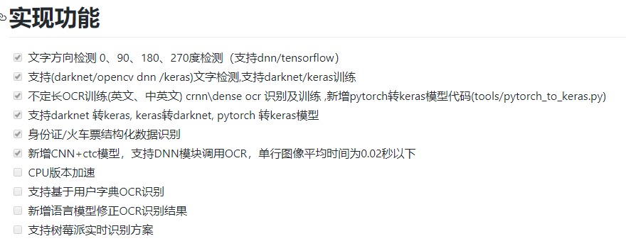
+ https://github.com/chineseocr/chineseocr
### 3.3 YOLOv3 in PyTorch > ONNX > CoreML > iOS
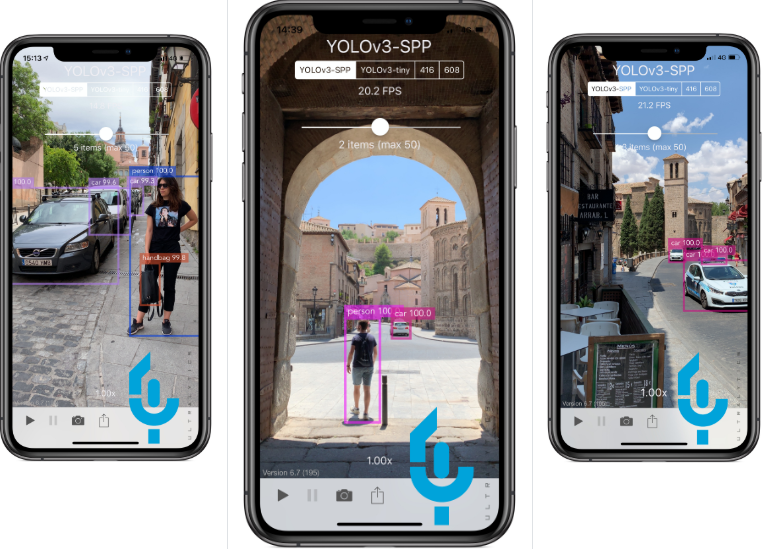
+ https://github.com/ultralytics/yolov3
### 3.4YoloV3/tiny-YoloV3+RaspberryPi3/Ubuntu LaptopPC+NCS/NCS2+USB Camera+Python+OpenVINO 
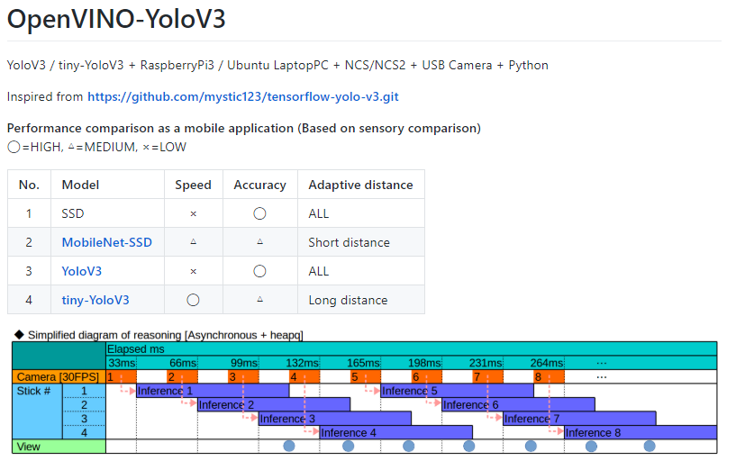
+ https://github.com/PINTO0309/OpenVINO-YoloV3
### 3.5基于darknet框架实现CTPN版本自然场景文字检测与CNN+CTCOCR文字识别
+ https://github.com/chineseocr/darknet-ocr 
### 3.6教程：用YOLO+Tesseract实现定制OCR系统
《Tutorial : Building a custom OCR using YOLO and Tesseract》
+ https://medium.com/saarthi-ai/how-to-build-your-own-ocr-a5bb91b622ba
### 3.7基于YOLOv3的交通信号违章检测系统
Traffic Signal Violation Detection System using Computer Vision - A Computer Vision based Traffic Signal Violation Detection System from video footage using YOLOv3 & Tkinter. (GUI Included)
+ https://github.com/anmspro/Traffic-Signal-Violation-Detection-System
### 3.8 OpenCV 'dnn' with NVIDIA GPUs: 1549% faster YOLO, SSD, and Mask R-CNN
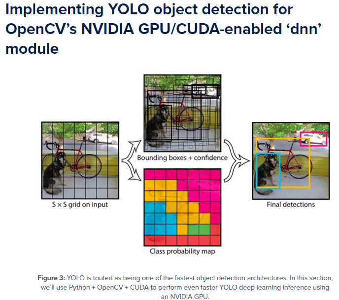
+ https://www.pyimagesearch.com/2020/02/10/opencv-dnn-with-nvidia-gpus-1549-faster-yolo-ssd-and-mask-r-cnn/
### 3.9 Object Detection and Tracking

+ https://github.com/yehengchen/Object-Detection-and-Tracking
### 3.10 基于yolov3轻量级人脸检测
加入关键点的darknet训练框架，使用yolov3实现了轻量级的人脸检测
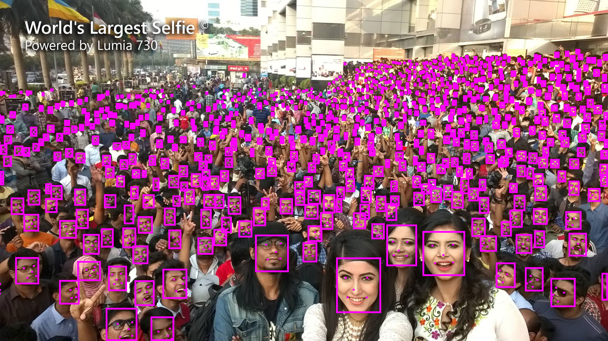

+ https://github.com/ouyanghuiyu/darknet_face_with_landmark
### 3.11 基于D/CIoU_YOLO_V3口罩识别
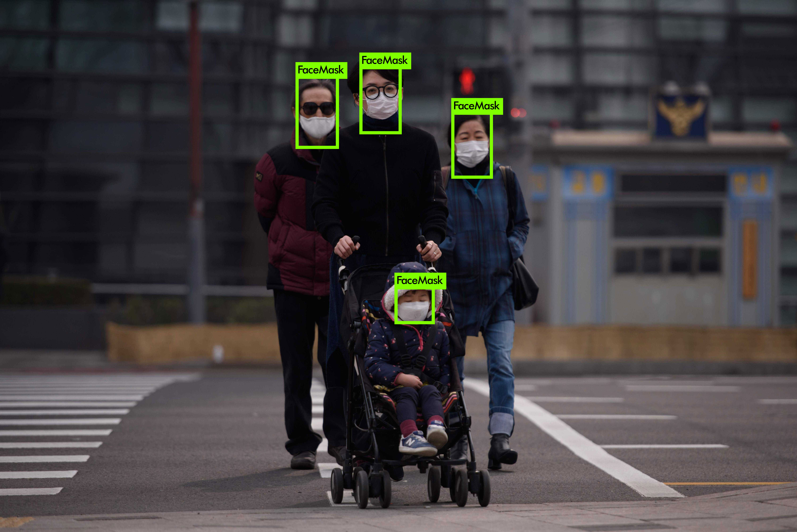
+ https://github.com/DataXujing/DIoU_YOLO_V3
### 3.12 Object Detection: YOLO, MobileNetv3 and EfficientDet
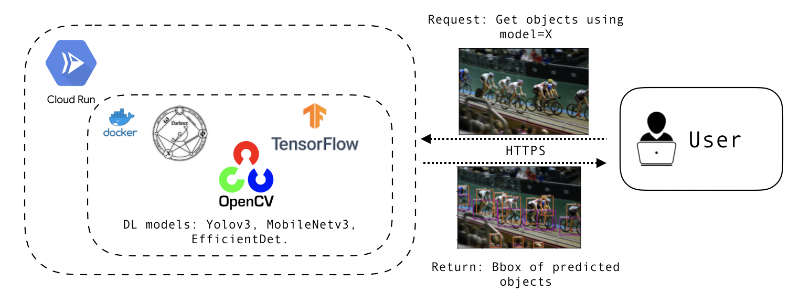
+ https://github.com/imadelh/Object-Detection_MobileNetv3-EfficientDet-YOLO
### 3.13 Yolo-Fastest：超超超快的开源ARM实时目标检测算法
Network|VOC mAP(0.5)|COCO mAP(0.5)|Resolution|Run Time(Ncnn 1xCore)|Run Time(Ncnn 4xCore)|FLOPS|Weight size
:---:|:---:|:---:|:---:|:---:|:---:|:---:|:---:
[MobileNetV2-YOLOv3-Nano](https://github.com/dog-qiuqiu/MobileNetv2-YOLOV3/tree/master/MobileNetV2-YOLOv3-Nano)|65.27|30.13|320|11.36ms|5.48ms|0.55BFlops|3.0MB
[Yolo-Fastest(our)](https://github.com/dog-qiuqiu/Yolo-Fastest/tree/master/Yolo-Fastest)|61.02|23.65|320|6.74ms|4.42ms|0.23BFlops|1.3MB
[Yolo-Fastest-XL(our)](https://github.com/dog-qiuqiu/Yolo-Fastest/tree/master/Yolo-Fastest)|69.43|32.45|320|15.15ms|7.09ms|0.70BFlops|3.5MB
+ https://zhuanlan.zhihu.com/p/234506503
+ https://github.com/dog-qiuqiu/Yolo-Fastest
+ https://github.com/dog-qiuqiu/MobileNet-Yolo
### 3.15 OpenCV ‘dnn’ with NVIDIA GPUs: 1549% faster YOLO, SSD, and Mask R-CNN
+ https://www.pyimagesearch.com/2020/02/03/how-to-use-opencvs-dnn-module-with-nvidia-gpus-cuda-and-cudnn/
+ https://www.pyimagesearch.com/2020/02/10/opencv-dnn-with-nvidia-gpus-1549-faster-yolo-ssd-and-mask-r-cnn/
## 四、YOLO模型压缩：
### 4.1、剪枝：
+ https://github.com/zbyuan/pruning_yolov3
+ https://github.com/coldlarry/YOLOv3-complete-pruning
+ https://github.com/Lam1360/YOLOv3-model-pruning
+ https://github.com/tanluren/yolov3-channel-and-layer-pruning
+ https://github.com/zbyuan/pruning_yolov3
+ https://github.com/SpursLipu/YOLOv3-ModelCompression-MultidatasetTraining-Multibackbone

## 五、YOLO系列
### 5.1 Enriching Variety of Layer-wise Learning Information by Gradient Combination
| Model | Size | mAP@0.5 | BFLOPs |
| :-- | :-: | :-: | :-- |
| EfficientNet_b0-PRN | 416x416 | 45.5 | 3.730 |
| EfficientNet_b0-PRN | 320x320 | 41.0 | 2.208 |
+ https://github.com/WongKinYiu/PartialResidualNetworks
### 5.2 Gaussian YOLOv3: An Accurate and Fast Object Detector Using Localization Uncertainty for Autonomous Driving
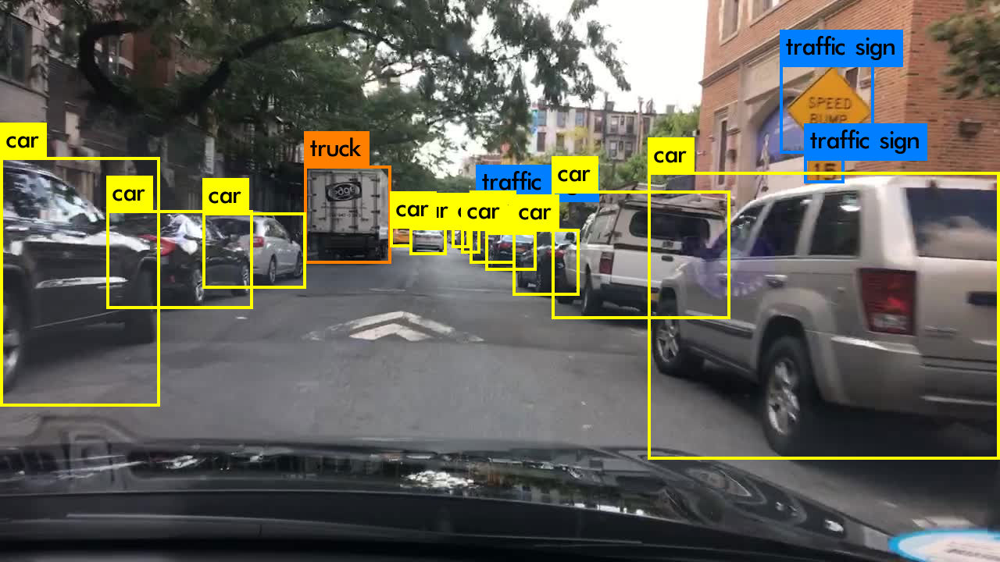
+ https://github.com/jwchoi384/Gaussian_YOLOv3
### 5.3 YOLO Nano: a Highly Compact You Only Look Once Convolutional Neural Network for Object Detection
| Model | model Size | mAP(voc 2007) | computational cost(ops) |
| :-- | :-: | :-: | :-- |
| Tiny YOLOv2[13] | 60.5MB | 57.1% | 6.97B |
| Tiny YOLOv3[14] | 33.4MB | 58.4% | 5.52B |
| YOLO Nano | 4.0MB | 69.1% | 4.57B |
+ https://arxiv.org/pdf/1910.01271.pdf
+ https://github.com/liux0614/yolo_nano
### 5.4YOLO-LITE: A Real-Time Object Detection Algorithm Optimized for Non-GPU Computers
| DataSet       | mAP           | FPS   |
| ------------- |:-------------:| -----:|
| PASCAL VOC    | 33.57         |   21  |
| COCO          | 12.26         |   21  |
+ https://arxiv.org/abs/1811.05588v1
+ https://github.com/reu2018dl/yolo-lite
+ https://mp.weixin.qq.com/s/xNaXPwI1mQsJ2Y7TT07u3g
### 5.5 SlimYOLOv3: Narrower, Faster and Better for Real-Time UAV Applications
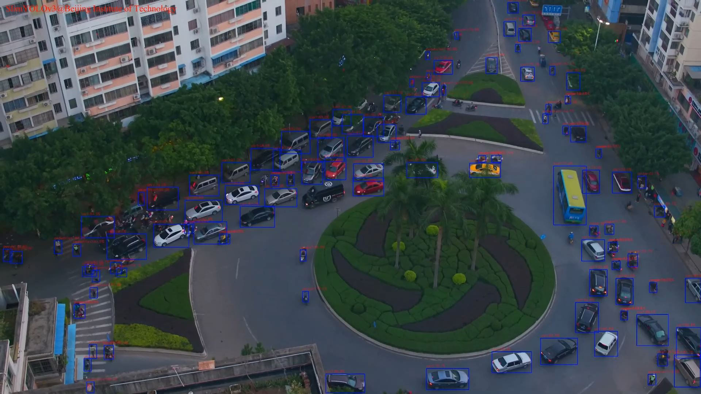
+ https://arxiv.org/ftp/arxiv/papers/1907/1907.11093.pdf
+ https://github.com/PengyiZhang/SlimYOLOv3
+ https://mp.weixin.qq.com/s/fDOskKqG-fsJmhT0-tdtTg
### 5.6 Strongeryolo-pytorch - Pytorch implementation of Stronger-Yolo with channel-pruning
#### Performance on VOC2007 Test(mAP) after pruning
|Model| Backbone|MAP | Flops(G)| Params(M)|
| ------ | ------ | ------ | ------ |------ |
|strongerv3| Mobilev2|79.6|4.33|6.775|
|strongerv3-sparsed|Mobilev2|77.4|4.33|6.775|
|strongerv3-Pruned(30% pruned) |Mobilev2|77.1 |3.14|3.36|
|strongerv2| Darknet53|80.2|49.8|61.6|
|strongerv2-sparsed|Darknet53|78.1|49.8|61.6|
|strongerv2-Pruned(20% pruned) |Darknet53|76.8 |49.8|45.2|

+ https://github.com/wlguan/Stronger-yolo-pytorch

### 5.7 Learning Spatial Fusion for Single-Shot Object Detection
YOLOv3+ASFF(自适应空间特征融合)组合，性能优于CornerNet和CenterNet等，在COCO上，38.1mAP/60 FPS，43.9mAP/29FPS！
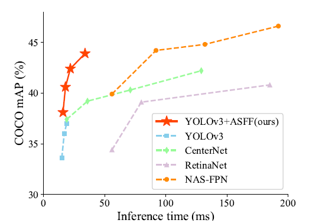

| System |  *test-dev mAP* | **Time** (V100) | **Time** (2080ti)|
|:-------|:-----:|:-------:|:-------:|
| [YOLOv3 608](http://pjreddie.com/darknet/yolo/) | 33.0 | 20ms| 24ms|
| YOLOv3 608+ [BoFs](https://arxiv.org/abs/1902.04103) | 37.0 | 20ms | 24ms|
| YOLOv3 608(ours baseline) | **38.8** | 20ms | 24ms|
| YOLOv3 608+ ASFF | **40.6** | 22ms | 28ms|
| YOLOv3 608+ ASFF\* | **42.4** | 22ms | 29ms|
| YOLOv3 800+ ASFF\* | **43.9** | 34ms | 40ms|
+ https://arxiv.org/pdf/1911.09516.pdf
+ https://github.com/ruinmessi/ASFF
+ https://zhuanlan.zhihu.com/p/110205719
### 5.8 Distance-IoU Loss: Faster and Better Learning for Bounding Box Regression
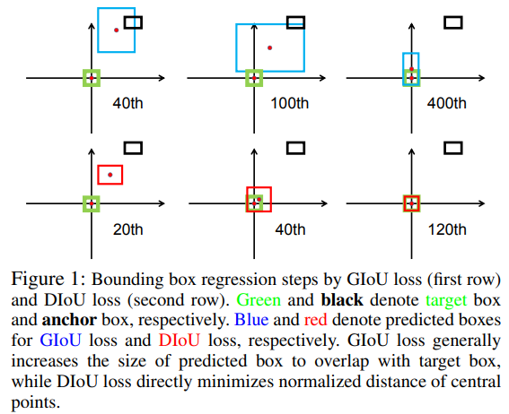
+ https://arxiv.org/pdf/1911.08287.pdf
+ https://github.com/Zzh-tju/DIoU-darknet
+ https://mp.weixin.qq.com/s/St5WevfcVt4RubJsY-ZEHw
### 5.9 xYOLO: A Model For Real-Time Object Detection In Humanoid Soccer On Low-End Hardware
+ https://arxiv.org/abs/1910.03159
### 5.10、CSPNet: A New Backbone that can Enhance Learning Capability of CNN
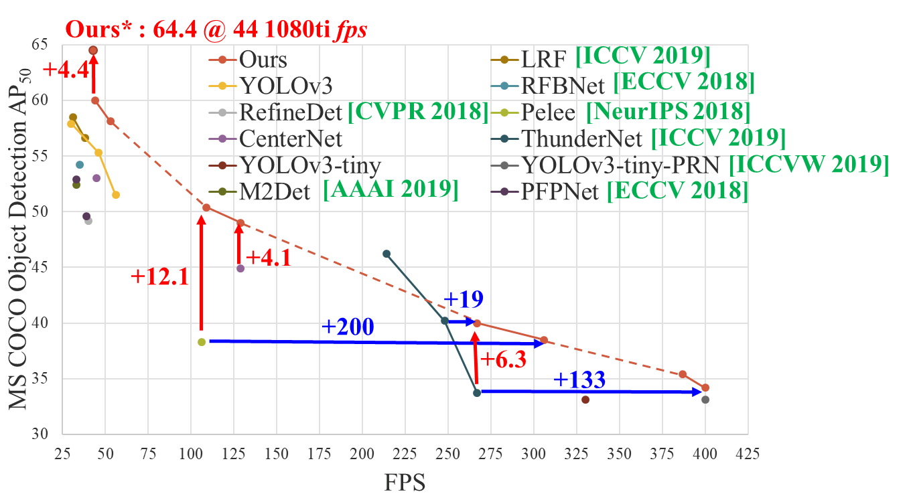
+ https://arxiv.org/abs/1911.11929
+ https://github.com/WongKinYiu/CrossStagePartialNetworks
### 5.11、Spiking-YOLO: Spiking Neural Network for Real-time Object Detection
+ https://arxiv.org/pdf/1903.06530.pdf
### 5.12、 Enriching Variety of Layer-wise Learning Information by Gradient Combination
+ https://github.com/WongKinYiu/PartialResidualNetworks/blob/master/pdf/iccvw-prn.pdf
+ https://github.com/WongKinYiu/PartialResidualNetworks
### 5.13、YOLOv4: Optimal Speed and Accuracy of Object Detection
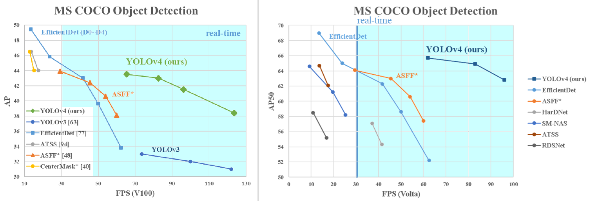
+ https://arxiv.org/abs/2004.10934
+ https://github.com/AlexeyAB/darknet
### 5.14、PP-YOLO: An Effective and Efficient Implementation of Object Detector
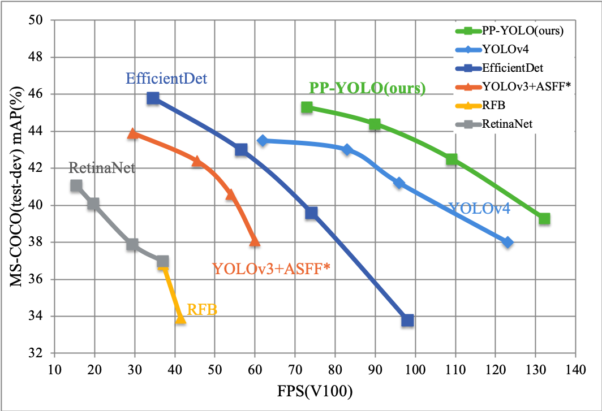
+ https://arxiv.org/abs/2007.12099
+ https://github.com/PaddlePaddle/PaddleDetection
+ https://zhuanlan.zhihu.com/p/163580627
### 5.15、Scaled-YOLOv4: Scaling Cross Stage Partial Network
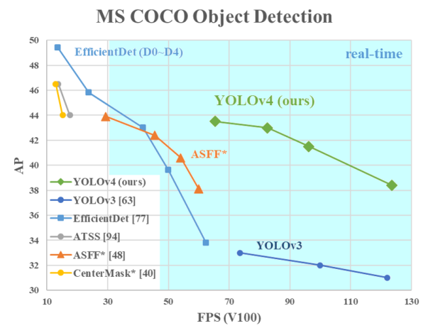
+ https://arxiv.org/abs/2011.08036
+ https://github.com/WongKinYiu/ScaledYOLOv4
### 5.16、You Only Look One-level Feature  
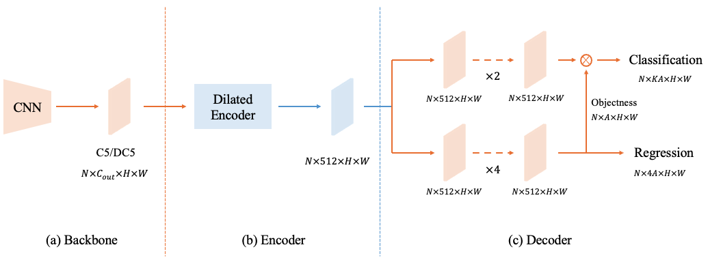
+ https://arxiv.org/abs/2103.09460
+ https://github.com/megvii-model/YOLOF